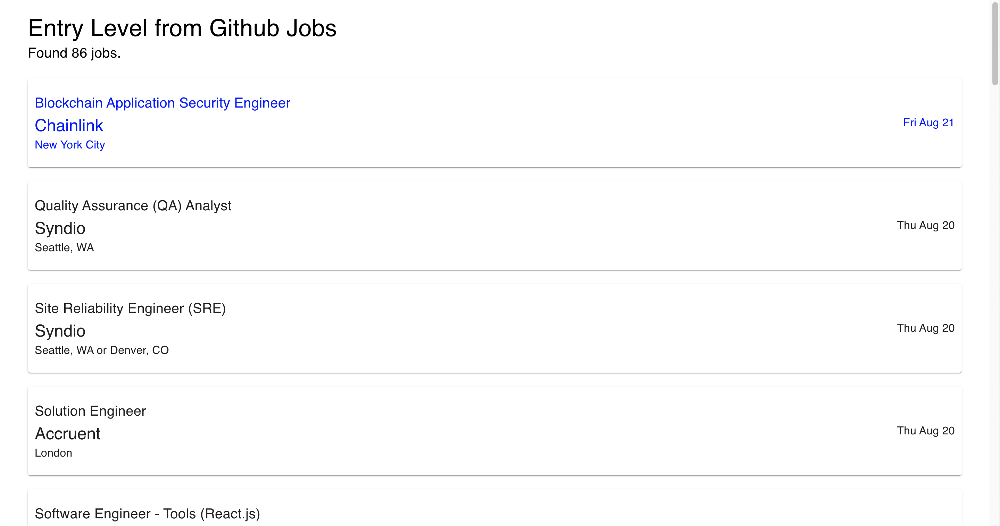
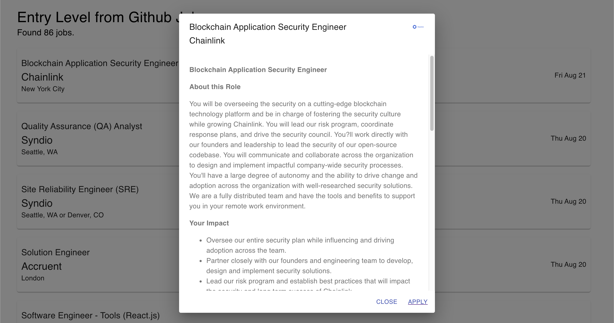
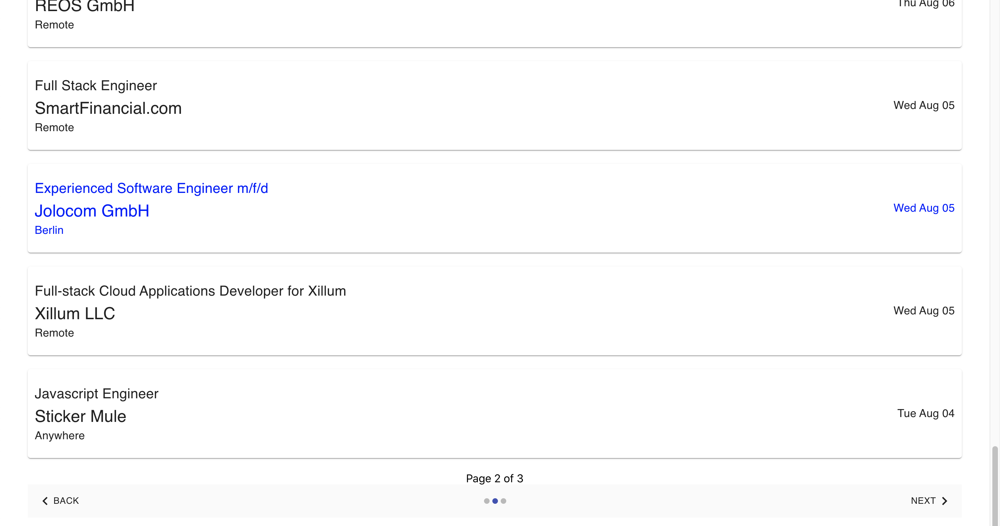

# React App with Redis Cache & API Calls

This is my implementation of a React web application which calls on an external API (Github Jobs), and then stores the retrieved data in a Redis cache. The idea was to aggregate entry level jobs from postings on Github Jobs. That may not seem completely clear so this is a breakdown of the flow of events:

1. Retrieve jobs from Github Jobs (via cron job)
2. Filter relevant jobs based suitable for entry level positions
3. Stringify filtered jobs onto Redis cache
4. Set up API endpoint for React app to call from Redis cache
5. Display jobs on React app
6. Paginate list of jobs

:shipit:

The packages used are as follows:
- [cron](https://www.npmjs.com/package/cron)
- [express](https://www.npmjs.com/package/express)
- [Redis](https://redislabs.com/lp/node-js-redis/)
- [node-fetch](https://www.npmjs.com/package/node-fetch) 
- [Material-UI](https://material-ui.com/)

I created this dashboard as I felt that my previous dashboard was lacking in features. In addition, there was no longevity, since the ticker options in that dashboard was limited to a single static CSV file, which will eventually be outdated. Hence I used the yfinance module, which ensures that tickers are up-to-date as long as the module remains alive. I also included useful indicators which I felt could help in making decisions on a stock, or conducting basic technical analysis on the selected stock.

However, there are still some limitations, since the data retrieval ultimately relies on another module. Yfinance is unable to provide certain resolutions of historical data, hence I was unable to obtain the appropriate intra-day data and I have fixed the resolution to 1 day. In addition, the aesthetics of the dashboard can be improved for better readability. Such an improvement could include visibly separating the charts, or hiding certain charts, so as to allow better human-level comparisons.

If you are unfamiliar with Yahoo Finance and the structure of their ticker symbols, you can simply type the appropriate equity's name into the search bar on their <a href="https://finance.yahoo.com/">homepage</a>.

## Overview

I wanted to create a React web application that implemented API calls and temporary storage solutions. I was previously familiar with direct API calls, but not with in-memory solutions. This was a problem because I did not want to make repeated API calls for similar data, and wanted a way to cache similarly queried data. Redis was a good candidate for in-memory data storage. As such, this application was built in order to reduce external API calls while maintaining a level of freshly retrieved data.

---

This repo consists of 3 folders.

- worker folder -> retrieves data from the external API (ie. Github Jobs) via a cron job, filters out unwanted job postings & stores it in Redis cache
- api folder -> allows client application to make API calls from Redis cache
- client folder -> frontend implementation with API calls made from Redis cache

---

This image shows the default page of the client application. The listings are retrieved from the Redis cache.

The image below shows the job title, description, company logo and application link when a job posting is clicked. Clicking on 'Apply' opens the original job posting in a new tab.

The image below shows the pagination of the jobs listed. This was to ensure the readability of job listings.

---

You can find the original Github Jobs <a href="https://jobs.github.com/" target="_blank">here</a>.
